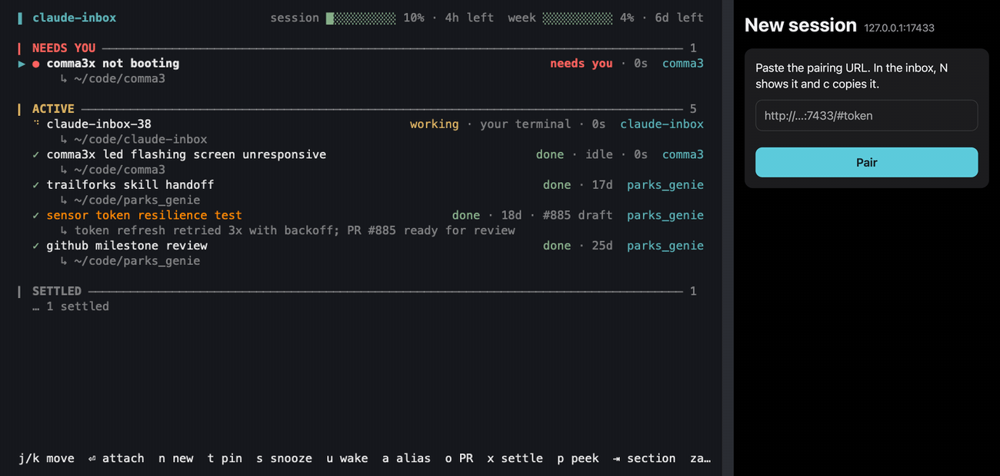

# claude-inbox

Inbox-style triage for Claude Code's background sessions. It reads the same
daemon state as `claude agents`, through `claude agents --json`, and adds
snooze, auto-settle and each session's pull request. Use it next to
`claude agents`, not instead of it.


## Install

```
gem install claude-inbox
claude-inbox
```

Requires Ruby 3.2+ and a `claude` on PATH with the agents feature. Versions
are published to rubygems and listed under GitHub Releases.
`claude-inbox --version` prints the installed version.

Put arguments you want on every launch in `~/.config/claude-inbox/config`.

## Sections

1. **Pinned.** Parked at the top by hand, whatever its state. `t` toggles it.
2. **Needs you.** `blocked` or `failed`, until you attach to it.
3. **Active.** `working`, finished but not yet settled, interactive, or a
   needs-you session you attached to that hasn't resolved. An interactive
   session only reports busy, idle or waiting, which show as working, done
   and needs you. A terminal you're sitting in never settles and can't be
   attached, peeked or stopped from here. Sub-agents and headless `claude -p`
   runs don't show up at all.
4. **Snoozed.** Sorted by wake time, with "until I wake it" entries last.
   Collapsed. Enter expands it.
5. **Settled.** Settled with `x`, or every pull request is merged or closed.
   Collapsed. Enter expands it.

A row with a pull request shows it after the state, as `#885 open`,
`#885 draft`, `#885 merged` or `#885 closed`. `o` opens it in the browser.

The daemon's `working` covers two cases, and the row tells them apart. A
spinner and `working` mean the agent is thinking. A steady `◌` and
`idle · 1 shell` mean it stopped and is waiting on something it started, such
as a `--watch` shell or a sub-agent. That's why a session with nothing left to
do can sit there for an hour.

Under each row in Pinned, Needs you and Active is the same line
`claude agents` prints. While blocked it's what the session waits on
(`↳ confirm: drop the top line?`), once done it's what it produced, and
otherwise it's the status line. A terminal you opened yourself has none, so
it shows its directory.

A session you gave a color with `/color` wears it on the label. Nothing else
is tinted, so a blocked session still looks blocked.

## Keys

Vim bindings. Arrows work as well as `j`/`k`. In terminals that report the
mouse, a click selects and attaches and the wheel moves the selection. Apple
Terminal reports neither.

| Key | Action |
|---|---|
| `j` `k` | move down / up |
| `gg` `G` | first / last row |
| `Ctrl-d` `Ctrl-u` | half page down / up (`Ctrl-f` `Ctrl-b` full page) |
| `Enter` `l` | attach (full-screen handoff; `←` or `Ctrl+Z` return here), adopt a remote session, or expand Snoozed / Settled |
| `Tab` `Shift+Tab` | jump to the next / previous section |
| `h` | close the peek pane, else collapse the current Snoozed / Settled fold |
| `za` `zo` `zc` | toggle / open / close the Snoozed or Settled fold under the cursor |
| `p` | toggle the read-only peek pane |
| `J` `K` (`Ctrl-e` `Ctrl-y`) | scroll the peek pane |
| `n` | new session |
| `N` | pair a phone: whether the inbox is listening, and the URL to pair with |
| `t` | pin / unpin |
| `s` | snooze: `1` 15m · `2` 1h · `3` tomorrow 9am · `4` until woken |
| `u` | wake a snoozed session now, or bring back one you settled |
| `x` | settle a working or needs-you session by hand (returns when it changes state, unless it just finished) |
| `a` | set a local alias (never touches the real session name) |
| `o` | open the session's pull request in the browser |
| `w` | open the session at claude.ai/code |
| `P` | link a pull request by hand (empty clears; the scanned links return) |
| `X` | stop the session (`y` to confirm) |
| `Ctrl-x` | delete the session for good, conversation and worktree with it (`y` to confirm) |
| `/` | filter by name, cwd, the prompt it started from, or what it is doing now; `Enter` keeps it, `Esc` clears |
| `R` | poll now |
| `q` | quit |

`X` and `Ctrl-x` both ask first and both take `y`, but they do different
things. `X` runs `claude stop`, which ends the process and keeps the
conversation, and `Enter` resumes it later. `Ctrl-x` runs `claude rm`, which
deletes the session, its transcript and its worktree. Nothing resumes after
that, so read the box before answering.

### New session

`n` opens a form with prompt, name, directory, model, effort, permissions,
worktree and Remote Control. `Tab` and `Shift+Tab` move between fields and
`Esc` cancels. Choice fields cycle with `h` `l` or the arrows, and "default"
shows what your settings resolve to. The directory starts as the selected
row's, and `Tab` completes it.

`Ctrl-S` starts the session and drops you back in the inbox. `Ctrl-O` starts
it and attaches. It runs `claude --bg "<prompt>"` in that directory with only
the flags you changed, and the new row is selected once it shows up.

The prompt is multi-line, and `Enter` breaks a line. Paste an image with
`Cmd-V` (or `Ctrl-V`) or drop a file on the window, and an `[Image #1]` token
lands at the cursor for the prompt to point at: "make the button look like
[Image #1]". Pasted images are kept in `~/.config/claude-inbox/images/` for
14 days. A dropped file is referenced where it is. Pasting images works on
macOS only.

Remote Control set to yes adds `--remote-control`, so the session also shows
up at claude.ai/code and in the Claude mobile app. It defaults to yes when
"Enable Remote Control for all sessions" is on in `/config`.

Type `/` at the start of a word for a menu of your skills and commands.
Plugin skills appear as `plugin:name` and claude.ai's synced skills as
`anthropic-skills:name`. `↑` `↓` choose, `Tab` or `Enter` insert, `Esc`
closes the menu. Built-ins such as `/init` aren't listed but still work.

## How sessions move

**Wake.** A snoozed session comes back when its timer runs out, when you
press `u`, or when it turns blocked or failed after you snoozed it. One that
was already blocked when you snoozed it stays snoozed, which is the point of
snoozing. `u` also brings back a settled row.

**Acknowledge.** Attaching to a needs-you session marks its state seen and
moves it to Active. It returns to Needs you when its state changes again. A
new prompt while still blocked doesn't count.

**Settle.** A session settles when you press `x` or when every pull request
it has is merged or closed. A hand-settled session stays put when it
finishes, and comes back on any other state change. `failed` never settles.
A session with no pull request never settles on its own, and one with an
open or draft PR stays Active.

**Reap.** On the next poll, the inbox deletes a background session that has
been quiet for 14 days with `claude rm`, transcript and worktree included.
It's the one thing here that deletes without asking. Reaping ignores Settled,
because an open draft keeps a row in Active for ever and those are exactly
the rows that need reaping. Idle time is the only clock.

The inbox never reaps a `working` session, one that still holds a process, a
pinned one or a snoozed one. It does reap `failed`, even though failed never
settles. After a fortnight of not looking at it, you won't. Pin or park a
session to keep it.

Unpushed work is safe, because `claude rm` refuses a worktree with unpushed
commits and the inbox never overrides that. Every reap adds a line to
`~/.config/claude-inbox/reaped.log`. `CLAUDE_INBOX_NO_REAP=1` turns reaping
off.

## Remote Control

A session with Remote Control on has a page at claude.ai/code, where you can
follow and drive it from a browser or the Claude mobile app. `w` opens it,
and the row shows `⇅` after the state. Two kinds of session have it.

- A background session started with Remote Control on, from the `n` form or
  as `claude --bg "…" --remote-control`. It behaves like any other row, and
  keeps Remote Control across a stop and a resume.
- A worker a `claude remote-control` server spawned when you started a
  session from your phone. The daemon can't attach to it, so `Enter` offers
  to adopt it. `y` ends the worker, resumes the conversation as a background
  session under the same id with Remote Control on, and attaches. The phone
  session you were in ends and a new one with the whole conversation takes
  its place. The server keeps running. A worker nobody has messaged yet has
  nothing to adopt.

## Starting sessions from your phone

With `--listen-lan`, a phone on your Wi-Fi or VPN can start sessions the way
`n` does. It's off unless you ask for it.



1. Start the inbox with `claude-inbox --listen-lan`, or put `--listen-lan`
   in `~/.config/claude-inbox/config` or `export CLAUDE_INBOX_LISTEN=lan` in
   your shell rc.
2. Press `N`, then `c` to copy the pairing URL. Universal Clipboard takes it
   to the phone.
3. Open it in Safari. To keep it, tap Share, then Add to Home Screen.
4. Open the new Inbox icon. It has its own storage, apart from Safari's, so
   paste the pairing URL once more and tap Pair.

LAN mode is plain HTTP, so the token and every prompt cross the network
readable by anyone on it. Use it only on a network you control. Anyone with
the token can start sessions as you in your projects. If the URL leaks, press
`r` in the `N` dialog to replace it.

A remote start may use the `default`, `auto` and `plan` permission modes.
[docs/remote-start.md](docs/remote-start.md) covers the rest, including ssh,
the firewall prompt, the JSON API and an iOS Shortcut.

## Pull request state

The daemon scans each background session's transcript for PR links, so a
session that only reviews a PR gets it too. It doesn't scan interactive
sessions. Use `P` to link one by hand, or to fix a bad scan.

The state comes from Claude Code's own cache, then from `gh pr view` at most
once a minute per PR. Without `gh`, you only get the cached state.

## Usage bars

The right end of the header shows how much of your 5-hour and 7-day rate
limit windows you've used. Each is a ten-cell bar that turns yellow at 70%
and red at 90%.

```
session ██░░░░░░░░ 24% · 3h left  week ████░░░░░░ 41% · 2d left
```

`session` is the 5-hour window and `week` the 7-day one, as `/usage` names
them. `3h left` is the time until that window resets. The bars need a Pro or
Max account and a one-time setup.

Claude Code passes the numbers to your
[status line](https://code.claude.com/docs/en/statusline) script every turn,
and the inbox reads them from a file that script writes. Put these lines in
the script, just after it reads stdin:

```bash
input=$(cat)
limits=$(echo "$input" | jq -c '.rate_limits // empty')
[ -n "$limits" ] && echo "$limits" > ~/.claude/rate_limits.json.tmp && mv ~/.claude/rate_limits.json.tmp ~/.claude/rate_limits.json
```

With no status line script, run `/statusline` in any session to get one,
then add the lines. Keep the `-n` check. A session's first status line run
has no numbers yet, and writing anyway would blank the file.

The bars stay hidden until the file exists, and hide again once it's more
than fifteen minutes old.

## Contributing

See [CONTRIBUTING.md](CONTRIBUTING.md).
