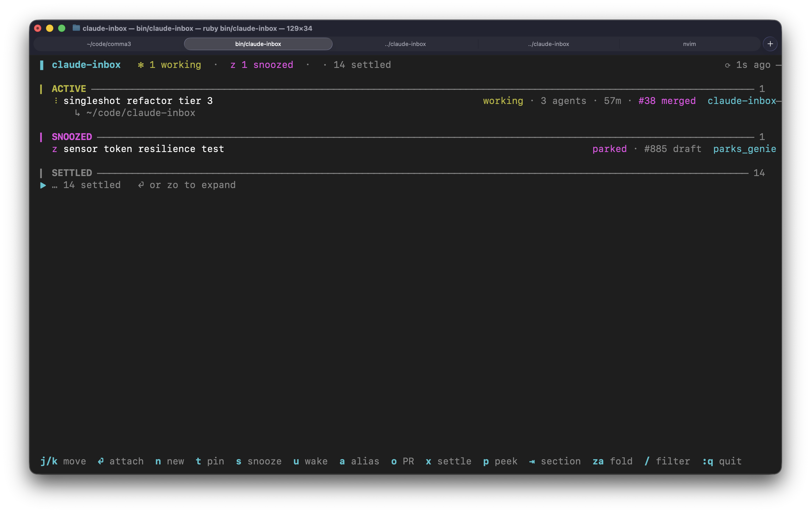

# claude-inbox

Inbox-style triage on top of Claude Code's background sessions. A companion to
`claude agents`, not a replacement: it reads the same daemon state through
`claude agents --json` and adds snooze, auto-settle and the session's pull
request.



## Install

```
gem install claude-inbox
claude-inbox
```

Requires Ruby 3.2+ and a `claude` on PATH with the agents feature. Versions
are published to rubygems and listed under GitHub Releases.
`claude-inbox --version` prints the installed version.

## Sections

1. **Pinned.** Parked at the top by hand, regardless of state. `t` toggles it.
2. **Needs you.** `blocked` or `failed`, until you attach to it (see
   Acknowledge below).
3. **Active.** `working`, recently finished sessions that haven't settled yet,
   interactive sessions, and a needs-you session you've attached to that
   hasn't resolved. Interactive sessions report only `status`, so it gets
   mapped: busy is working, idle is done, waiting needs you. The daemon calls
   a terminal you opened yourself, a Remote Control worker, a sub-agent and a
   headless `claude -p` run all "interactive"; the inbox tells them apart from
   the process tree. Sub-agents and headless runs are dropped, since nobody is
   sitting in them. Remote sessions settle and snooze like any other row,
   and Enter pulls one into the daemon (see Remote Control below). A
   terminal you are sitting in never settles and can't be attached, peeked
   or stopped from outside; Enter tells you so.
4. **Snoozed.** Sorted by wake time, parked ("until I wake it") entries last.
   Collapsed; Enter expands.
5. **Settled.** Parked with `x`, or whose pull request is merged or closed.
   Collapsed; Enter expands.

A row with a pull request shows it after the state: `#885 open`, `#885 draft`,
`#885 merged`, `#885 closed`. `o` opens it in the browser.

`working` from the daemon covers two situations, and the row says which. A
spinner and `working` mean the agent is thinking. A steady `◌` and `idle · 1
shell` mean the agent has stopped and is waiting on work it started, such as a
`--watch` shell or a sub-agent. That is why a session with nothing left to do
can sit there for an hour. The open work is named next to the state either
way: `working · 2 agents`, `idle · 1 shell`.

Under each row in Pinned, Needs You and Active is the line `claude agents`
prints too: what it is waiting on while blocked (`↳ confirm: drop the top
line?`), what it produced once done, otherwise its status line. A terminal you
opened yourself has none and shows its directory instead.

A session you gave a color to with `/color` wears it on the label. Nothing
else is tinted, so a blocked session still looks blocked.

## Keys

Vim bindings; arrows work as well as `j`/`k`. The mouse works too, in
terminals that report it: clicking a row selects and attaches, and the wheel
moves the selection. Apple Terminal reports neither, so there the wheel
scrolls its own history and clicks do nothing.

| Key | Action |
|---|---|
| `j` `k` | move down / up |
| `gg` `G` | first / last row |
| `Ctrl-d` `Ctrl-u` | half page down / up (`Ctrl-f` `Ctrl-b` full page) |
| `Enter` `l` | attach (full-screen handoff; `←` or `Ctrl+Z` return here), adopt a remote session, or expand Snoozed / Settled |
| `Tab` `Shift+Tab` | jump to the next / previous section |
| `h` | close the peek pane, else collapse the current Snoozed / Settled fold |
| `za` `zo` `zc` | toggle / open / close the Snoozed or Settled fold under the cursor |
| `p` | toggle the read-only peek pane |
| `J` `K` (`Ctrl-e` `Ctrl-y`) | scroll the peek pane |
| `n` | new session (see below) |
| `N` | pair a phone: whether the inbox is listening, and the URL to pair with (see Starting sessions from your phone) |
| `t` | pin / unpin |
| `s` | snooze: `1` 15m · `2` 1h · `3` tomorrow 9am · `4` until woken |
| `u` | wake a snoozed session now, or bring back one you settled |
| `x` | settle a working or needs-you session by hand (returns when it changes state, unless it just finished) |
| `a` | set a local alias (never touches the real session name) |
| `o` | open the session's pull request in the browser |
| `w` | open the session at claude.ai/code |
| `P` | link a pull request by hand (empty clears; the scanned links return) |
| `X` | stop the session (`y` to confirm) |
| `Ctrl-x` | delete the session for good, conversation and worktree with it (`y` to confirm) |
| `/` | filter by name, cwd, the prompt it started from, or what it is doing now; `Enter` keeps it, `Esc` clears |
| `R` | poll now |
| `q` | quit |

`X` and `Ctrl-x` both ask first, and both take `y`, but they are not the same
thing. `X` runs `claude stop`: the process ends, the conversation is kept, and
`Enter` resumes it later. `Ctrl-x` runs `claude rm`: the session, its
transcript and its worktree all go. Nothing resumes afterwards, so read the
box before answering.

### New session

`n` opens a form: prompt, name, directory, model, effort, permissions,
worktree, Remote Control. `Tab` / `Shift+Tab` move between fields, `Esc` cancels. Choice
fields cycle with `h` `l` or the arrows; "default" shows what your settings
resolve to. The directory defaults to the selected row's, and `Tab` completes
it.

`Ctrl-S` starts the session and drops you back in the inbox; `Ctrl-O` starts
it and attaches. Either way the new row is selected once it shows up. It runs
`claude --bg "<prompt>"` in that directory, with only the flags you changed.

The prompt is multi-line; `Enter` breaks a line. Paste an image with `Cmd-V`
(or `Ctrl-V`), or drop a file onto the window, and it lands at the cursor as
an `[Image #1]` token the prompt can point at: "make the button look like
[Image #1]". Pasted images are saved under `~/.config/claude-inbox/images/`
for 14 days; a dropped file is referenced where it is. Reading the clipboard
is macOS only.

Remote Control set to yes starts the session with `--remote-control`, so it
runs under the daemon like any other row and is also listed at claude.ai/code
and in the Claude mobile app. It defaults to yes when "Enable Remote Control
for all sessions" is on in Claude Code's `/config`. See Remote Control below.

Slash commands work as at Claude Code's own prompt. Type `/` at the start of a
word for a menu of your skills and commands, plugin skills as `plugin:name`,
claude.ai's synced skills as `anthropic-skills:name`. `↑` `↓` choose, `Tab` or
`Enter` insert, `Esc` closes the menu. Built-ins such as `/init` aren't listed
but still work.

## How sessions move

**Wake.** A snoozed session returns when its timer elapses, when you press
`u`, or when it becomes blocked or failed after being snoozed. A session that
was already blocked when you snoozed it stays snoozed; that is the point of
snoozing. `u` also brings back a settled row and puts it wherever its raw
state belongs.

**Acknowledge.** Attaching to a needs-you session marks its current state
seen and moves it to Active. It comes back to Needs You when its state
changes again. Still blocked with a new prompt doesn't count.

**Settle.** Settled by hand with `x`, or because every pull request it has is
merged or closed. A hand-settled session stays put when it finishes, and
returns as soon as it changes state in any other way. `failed` never settles.
A session with no pull request never settles on its own, however long it has
been quiet. A session with one stays Active while any of its PRs is open or a
draft.

**Reap.** A background session quiet for 14 days is deleted on the next poll
with `claude rm`, so the transcript and the worktree go with it, same as
`Ctrl-x`. This is the one thing here that destroys anything without asking
first. Reaping does not key on Settled: an open draft keeps a row in Active
for ever, and those are precisely the rows that need reaping. Idle time is the
only clock.

Never reaped, whatever the clock says: a `working` session, one that still
holds a process, a pin, and a snooze. `failed` is reaped, even though it never
settles; after a fortnight of not looking at it you never will. A pin or a
parked snooze is the way to keep a session indefinitely.

Unpushed work is safe. `claude rm` refuses a worktree holding commits that
aren't pushed, and nothing here ever overrides that refusal. Every reap
appends a line to `~/.config/claude-inbox/reaped.log`, the last record a
session existed once its transcript is gone. `CLAUDE_INBOX_NO_REAP=1` turns
reaping off.

## Remote Control

A session with Remote Control on has a page at claude.ai/code, where you can
follow and drive it from a browser or the Claude mobile app, the way `claude
--remote-control` and `/rc` allow in a terminal; `w` opens it. Its row
wears a `⇅` after the state. Two kinds of session have it:

- A background session the `n` form started with Remote Control set to yes,
  or one you ran as `claude --bg "…" --remote-control` yourself. It is a
  daemon row like any other: `Enter` attaches, `X` stops, and it keeps its
  Remote Control across a stop and a wake, since the daemon saves the flag.
- A worker a `claude remote-control` server spawned for a request from your
  phone. That is how a session started away from the desk lands on this
  machine. The daemon calls it interactive and can't attach to it, so
  `Enter` offers to adopt it instead: `y` ends the worker and resumes the
  conversation as a background session under the same id, with Remote
  Control on, and attaches. The phone session you were in ends there and a
  new one takes its place, with the whole conversation; the server keeps
  running for the next request. A worker nobody has messaged yet has
  nothing to adopt, and Enter says so.

## Starting sessions from your phone

The inbox can also listen for HTTP requests to start a session, so a phone
can do what `n` does while you are away from the desk. It is off unless you
ask for it:

| Flag | Environment | What it does |
|---|---|---|
| `--listen[=PORT]` | `CLAUDE_INBOX_LISTEN=7433` | listens on `127.0.0.1` only, for an ssh tunnel or scripts on this Mac |
| `--listen-lan[=PORT]` | `CLAUDE_INBOX_LISTEN=lan` or `lan:7433` | listens on every interface: your LAN, and a VPN into it |
| `--listen-allow-modes=default,plan` | `CLAUDE_INBOX_LISTEN_ALLOW_MODES=default,plan` | the permission modes a remote start may use (see below) |

The port defaults to 7433, and a flag wins over the environment. The LAN is
never reached by accident: only `--listen-lan` or `CLAUDE_INBOX_LISTEN=lan`
binds every interface, and with both flags given `--listen-lan` wins and
its own port (or 7433) is used. `--fixture` ignores the environment but
takes the flags, which is how to try the API without starting anything
real, and keeps a token of its own. One inbox per user listens; a second
one says which process has the listener, and takes over when it quits.

**Over your VPN.** Start the inbox with `--listen-lan`, or put
`export CLAUDE_INBOX_LISTEN=lan` in your shell rc. Press `N`. It shows two
pairing URLs with the token cut short: `http://mac-mini.local:7433/#…` for
when the phone is on your Wi-Fi, and `http://192.168.1.20:7433/#…` for over
the VPN, since `.local` names don't cross a tunnel. `c` copies the address
form in full, token included, and Universal Clipboard takes it to the phone.
LAN mode is plain HTTP: the token and every prompt cross the network
readable by anyone on it, so use it only on a network you control.

The first time, macOS asks whether `ruby` may accept incoming connections;
allow it. It asks again after a Ruby upgrade, because the binary's path
changes. With the firewall set to block all incoming connections, or with
stealth mode on and `ruby` denied, the phone gets no answer at all and
nothing says why; `N` shows the firewall's state.

**Over ssh.** Plain `--listen` answers only on `127.0.0.1`. From another
machine, `ssh -L 7433:127.0.0.1:7433 you@your-mac` and use
`http://localhost:7433`; any free local port works in place of the first
7433. Use plain `--listen` for this, not `--listen-lan`: macOS lets another
program on this Mac bind `127.0.0.1:7433` next to LAN mode's
`0.0.0.0:7433` and take the loopback traffic, token and all.

**Pairing.** The token lives in `~/.config/claude-inbox/listen.json`,
readable by you alone, and stays the same across launches. In the `N`
dialog, `r` and then `y` replaces it; every paired phone gets 401 until it
pairs again. The dialog also lists the last five remote starts, refusals
and rejected tokens, counting a repeat rather than listing it again. Anyone with the token can start sessions as
you, in your projects: treat a leaked URL like a leaked password, and press
`r`.

**The page.** The pairing URL opens the `n` form, sized for a phone:
prompt, name, directory, model, effort, permissions, worktree and Remote
Control, which starts out on, since you are away from the desk. The
directories are the ones your sessions ran in lately, then the projects
whose trust dialog you accepted, and the one you picked last is picked
again. "default" in a list says what that directory's settings make it:
`default (opus)`. Add image takes a photo or picks from the library, scales
it to 2000 pixels on the long edge and sends it as a JPEG, which leaves the
photo's metadata, location included, on the phone; an `[Image #1]` lands at
the cursor, as a paste does in the form. What you type is kept on the phone
until a start goes through, a refusal shows under the field it is about,
and a start that went through gives the session's id and an Open in Claude
link to its claude.ai/code page. The page keeps the token and takes it out
of the address bar. Once the token is rotated it says "token rejected:
press N in the inbox and pair again" and asks for the new pairing URL.

**On the home screen.**

1. In the inbox, press `N` and then `c`. The pairing URL, token and all, is
   on the clipboard, and Universal Clipboard takes it to the phone.
2. On the phone, paste it into Safari and open it.
3. Tap Share, then Add to Home Screen, then Add.
4. Open the new icon. It keeps its own storage, apart from Safari's, so the
   first time it asks for the token: paste the pairing URL again and tap
   Pair.

The page comes from the inbox itself, so with the inbox closed or the Mac
asleep the icon has nothing to open.

**Permission modes.** A remote start may use `default`, `auto` and `plan`,
nothing wider. `default` means whatever your settings say for that
directory, so it is worked out first: a project whose settings default to
`bypassPermissions` is refused with 403 rather than started.
`--listen-allow-modes` gives the list in full, for example
`--listen-allow-modes=default,plan,acceptEdits`. Settings files the inbox
doesn't read, such as managed settings, aren't taken into account when it is
worked out.

**The API.** `GET /api/options` lists the models, efforts, permission modes
and directories a start can use, each directory with a short `label` and the
defaults its settings give. `POST /api/sessions` starts one. The token is
the part of the pairing URL after the `#`, or:

```sh
TOKEN=$(ruby -rjson -e 'puts JSON.parse(File.read(File.expand_path("~/.config/claude-inbox/listen.json")))["token"]')
curl -H "Authorization: Bearer $TOKEN" -H 'Content-Type: application/json' \
  -d '{"prompt":"fix the flaky spec","cwd":"claude-inbox","remote":true}' \
  http://192.168.1.20:7433/api/sessions
```

The fields are those of the `n` form: `prompt`, `name`, `cwd` (a path, or a
directory's label), `model`, `effort`, `permission_mode`, `worktree` and
`remote`, plus `images`, up to eight `{"data": "<base64>"}` PNG, JPEG, GIF
or WebP images that the prompt can point at as `[Image #1]`. Left out,
`remote` follows "Enable Remote Control for all sessions" in `/config`, as
the form's default does. An unknown key
is refused, so a misspelt setting can't quietly fall back to its default.
The answer is `201 {"id", "name", "cwd", "url"}`, where `url` is the
session's claude.ai/code page, or null if it hasn't registered yet. A
refusal is `{"error", "field"}` with the same message the form would show,
and a CLI refusal such as "Workspace not trusted" comes back as a 500. Send
an `Idempotency-Key` header and a retry gets the first answer instead of a
second session.

**A Shortcut.** To start a session from the share sheet, with the photos or
text you shared, a Shortcut can send the same request. In outline:

1. Receive Images and Text from the Share Sheet.
2. Get Images from the Shortcut Input, and Repeat with Each: Resize Image
   to 2000 on the longest edge, Convert Image to JPEG, Base64 Encode, a
   Dictionary with `data` set to the encoded text, and Add to Variable
   `images`.
3. Ask for Input for the prompt, with the shared text as its default.
4. Get Contents of URL `http://192.168.1.20:7433/api/sessions`, method POST,
   with the headers `Authorization: Bearer <token>` and `Idempotency-Key`
   (the Current Date will do), and a JSON body: `prompt`, `cwd` as a
   directory's label from `/api/options` such as `claude-inbox`, `remote`
   true, and `images` as the variable.
5. Show the answer, or Open URLs on its `url`.

Put the token in a Text action at the top. If you share the Shortcut, make
that action an Import Question, so the token isn't in what you share.

A remote start never moves the cursor, attaches, or closes what you have
open. The header says `started 31472308 from 192.168.1.30`, and the row
turns up on the next poll.

The header shows `◉ :7433` while the inbox listens (`◉ lan:7433` in LAN
mode), and a red `◉ !` while it was asked to and can't: another inbox has
the listener, or something else holds the port. It tries again every few
seconds and turns blue once it has the port. If an inbox quits while a
client still has a connection open, the port can stay held for half a
minute after. Anything else, such as a `~/.config/claude-inbox` it can't
write to, stays red, and `N` says what went wrong.

## Pull request state

The daemon scans each background session's transcript for PR links, so a
session that only reviews a PR gets it too. Interactive sessions aren't
scanned; `P` sets the link by hand for those, or to correct a bad scan.

State comes from whatever Claude Code last saw, then `gh pr view` on the
poller thread, at most once a minute per PR. Without `gh` the cached state is
all you get. The list goes up before gh is asked, so the inbox is up in under
a second.

## Setup

The right end of the header shows how much of your Claude subscription's
5-hour and 7-day rate limit windows you have used, as a ten-cell bar per
window that turns yellow at 70% and red at 90%, like the context bar many
status lines draw:

```
session ██░░░░░░░░ 24% · 3h left  week ████░░░░░░ 41% · 2d left
```

`session` is the 5-hour window and `week` the 7-day one, as Claude's own
`/usage` names them; `3h left` is how long until that window resets. It needs
a Pro or Max account and a one-time setup.

Claude Code passes the numbers to your [status line](https://code.claude.com/docs/en/statusline)
script every turn, and the inbox reads them from a file that script writes.
Put these two lines in the script, just after it reads stdin:

```bash
input=$(cat)
limits=$(echo "$input" | jq -c '.rate_limits // empty')
[ -n "$limits" ] && echo "$limits" > ~/.claude/rate_limits.json.tmp && mv ~/.claude/rate_limits.json.tmp ~/.claude/rate_limits.json
```

If you have no status line script, run `/statusline` in any session and it
writes one for you, then add the lines to that. Keep the `-n` check: a
session's first status line run has no numbers yet, and writing anyway would
blank the file.

The bars stay off until the file exists, and goes off again once the file
is more than fifteen minutes old.

To start sessions from your phone as well, see [Starting sessions from your phone](#starting-sessions-from-your-phone).

## Contributing

See [CONTRIBUTING.md](CONTRIBUTING.md).
