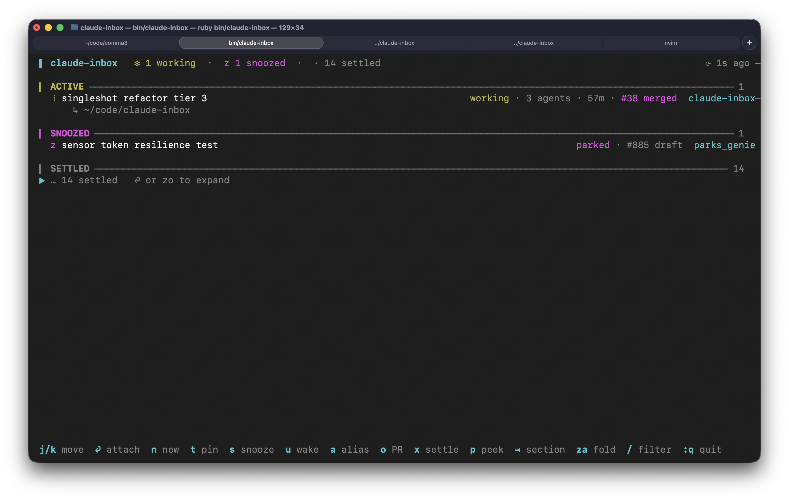
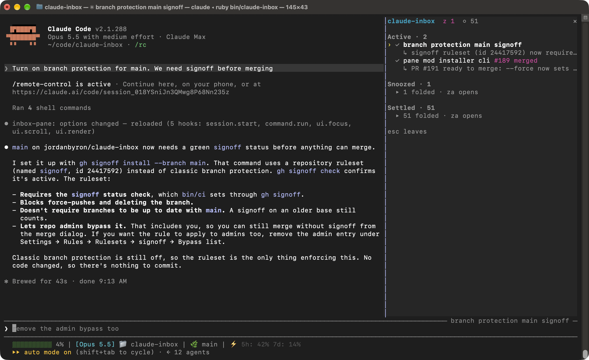
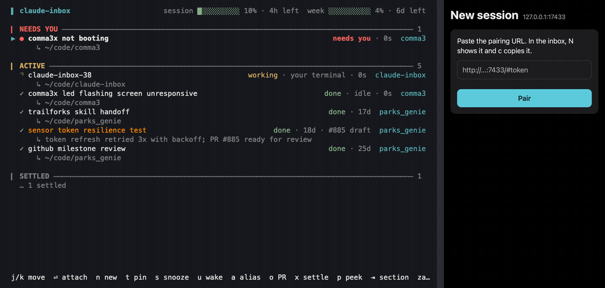

# claude-inbox

An inbox for Claude Code's background sessions. It lists what `claude agents`
lists and adds snooze, settle, pinning and each session's pull request.

I liked the workflow in Theo's [T3 Code](https://github.com/pingdotgg/t3code)
and wanted a better way to manage my Claude agents, so I built this.



## Install

Requires Ruby 3.2+ and `claude` on PATH.

```
gem install claude-inbox
claude-inbox
```

Put arguments you want on every launch in `~/.config/claude-inbox/config`.

To add the pane to every Claude Code session:

```
claude-inbox install
```

`claude-inbox install --force` also replaces any other copy of the pane.

## Claude Code pane

The same inbox as a pane inside Claude Code, docked beside the transcript in
a fullscreen terminal.



`/inbox` opens it, `ctrl+x tab` focuses it and `esc` leaves. The keys are the
ones below, with `ge` for `G`, `n` `p` for `Tab` `Shift+Tab`, and no `a`,
`P`, `X`, `Ctrl-x`, `/` or `R`. `Enter` switches to the session when you
attached through `claude-inbox`.

It opens when a session starts. To stop that, set
`pluginConfigs.inbox-pane.options.openOnStart` to `false` in
`~/.claude/settings.json`.

## Sections

1. **Pinned.** Rows you pinned with `t`.
2. **Needs you.** Blocked or failed sessions you haven't attached to yet.
3. **Active.** Everything else that's running or not yet settled, including
   interactive terminals.
4. **Snoozed.** Sorted by wake time. Collapsed.
5. **Settled.** Settled with `x`, or every pull request is merged or closed.
   Collapsed.

Under each row is what the session is waiting on, what it produced, or its
status line. A row with a pull request shows it as `#885 open`, `#885 merged`
and so on. A steady `◌` with `idle · 1 shell` means the agent stopped and is
waiting on a shell or sub-agent it started.

## Keys

Vim bindings. Arrows and the mouse work too.

| Key | Action |
|---|---|
| `j` `k` | move down / up |
| `gg` `G` | first / last row |
| `Ctrl-d` `Ctrl-u` | half page down / up (`Ctrl-f` `Ctrl-b` full page) |
| `Enter` `l` | attach (`←` or `Ctrl+Z` returns here), adopt a remote session, or expand Snoozed / Settled |
| `Tab` `Shift+Tab` | next / previous section |
| `h` | close the peek pane, else collapse the current fold |
| `za` `zo` `zc` | toggle / open / close the fold under the cursor |
| `p` | toggle the read-only peek pane |
| `J` `K` (`Ctrl-e` `Ctrl-y`) | scroll the peek pane |
| `n` | new session |
| `N` | pair a phone |
| `t` | pin / unpin |
| `s` | snooze: `1` 15m · `2` 1h · `3` tomorrow 9am · `4` until woken |
| `u` | wake a snoozed session, or bring back a settled one |
| `x` | settle by hand |
| `a` | set a local alias |
| `o` | open the pull request in the browser |
| `w` | open the session at claude.ai/code |
| `P` | link a pull request by hand (empty clears) |
| `X` | stop the session; `Enter` resumes it later |
| `Ctrl-x` | delete the session, transcript and worktree for good |
| `/` | filter; `Enter` keeps it, `Esc` clears |
| `R` | poll now |
| `q` | quit |

`X` and `Ctrl-x` both ask for `y` first.

### New session

`n` opens a form for the prompt, name, directory, model, effort, permissions,
worktree and Remote Control. `Tab` moves between fields, `Ctrl-S` starts the
session and `Ctrl-O` starts it and attaches.

Paste an image on macOS, or drop a file into the prompt, and refer to it as
`[Image #1]`. Type `/` for a menu of your skills.

## How sessions move

A snoozed session wakes when its timer runs out, when you press `u`, or when
it becomes blocked or failed.

Attaching to a needs-you session moves it to Active until its state changes
again.

A session settles when you press `x` or when all its pull requests are merged
or closed. A session without a pull request only settles by hand.

With `--reap`, the inbox deletes background sessions that have been idle for
14 days, with `claude rm`. Working, pinned and snoozed sessions are kept, and
`claude rm` refuses a worktree with unpushed commits. Each deletion is logged
to `~/.config/claude-inbox/reaped.log`.

## Remote Control

Sessions with Remote Control show `⇅`, and `w` opens them at claude.ai/code.
A session started from your phone through `claude remote-control` can't be
attached directly, so `Enter` offers to adopt it as a background session.

## Starting sessions from your phone

With `--listen-lan`, a phone on your network can start sessions.



1. Run `claude-inbox --listen-lan`.
2. Press `N`, then `c` to copy the pairing URL.
3. Open it on the phone in Safari and tap Share, then Add to Home Screen.
4. Open the Inbox icon, paste the URL again and tap Pair.

LAN mode is plain HTTP. Use it only on a network you control, and press `r`
in the `N` dialog if the URL leaks. [docs/remote-start.md](docs/remote-start.md)
covers ssh, the JSON API and an iOS Shortcut.

## Pull requests

Pull requests show up when a session's transcript links to them. Install
`gh` to keep their state current. Use `P` to link one by hand.

## Usage bars

The header can show your 5-hour and 7-day rate limit usage:

```
session ██░░░░░░░░ 24% · 3h left  week ████░░░░░░ 41% · 2d left
```

This needs a Pro or Max account. Add these lines to your
[status line](https://code.claude.com/docs/en/statusline) script, just after
it reads stdin. Run `/statusline` first if you don't have one.

```bash
input=$(cat)
limits=$(echo "$input" | jq -c '.rate_limits // empty')
[ -n "$limits" ] && echo "$limits" > ~/.claude/rate_limits.json.tmp && mv ~/.claude/rate_limits.json.tmp ~/.claude/rate_limits.json
```

## Contributing

See [CONTRIBUTING.md](CONTRIBUTING.md).
